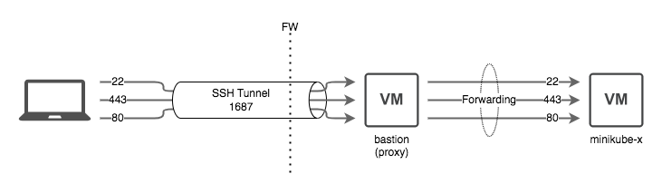

**IBM Korea OSS Training**: Kubernetes Fundamentals for Administrators
# *H*ands-on scripts for training Kubernetes basics*

* *Day One: Kubernetes 101*
  * [Create a Kubernetes cluster using minikube](./hands-on-scripts/day-1/1.md)
* *Day Two: Kubernetes Resources*
  * [Deploy an App with Deployment](./hands-on-scripts/day-2/1.md)
  * [Expose your App](./hands-on-scripts/day-2/2.md)
  * [Separate config file from image using a ConfigMap](./hands-on-scripts/day-2/3.md)
* *Day Three: Deploying Workloads*
  * [Deploying Bookstack App](./hands-on-scripts/day-3/1.md)
* *Day Four: Kubernetes Ecosystem*
  * [Ingiress NGINX: Expose a service using Ingress](./hands-on-scripts/day-4/1.md)
  * [Prometheus Stack: Enable monitoring and alerting](./hands-on-scripts/day-4/2.md)
  * [cert-manager: Securing a service](./hands-on-scripts/day-4/3.md)
* *Day Five: Administer a Kubernetes Cluster*
  * [Manage Pod Resources](./hands-on-scripts/day-5/1.md)
  * [Declare Network Policy](./hands-on-scripts/day-5/2.md)
  * [Upgrade a Cluster](./hands-on-scripts/day-5/3.md)

# Lab Environment

## Lab Servers

  No|User Mail|Lab Server|IP Address|User
  ---|---|---|---|---
  1|jw.shin85@hanwha.com|minikube-1|172.24.2.121|ubuntu
  2|sanghyeok.chung@hanwha.com|minikube-2|172.24.2.221|ubuntu
  3|jurikim@hanwha.com|minikube-3|172.24.1.248|ubuntu
  4|s.kim1521@hanwha.com|minikube-4|172.24.1.89|ubuntu
  5||minikube-5|172.24.2.213|ubuntu
  6|dahyekim@hanwha.com|minikube-6|172.24.2.84|ubuntu
  7|wjdtjsdlf210@hanwha.com|minikube-7|172.24.2.166|ubuntu
  8|go5man@hanwha.com|minikube-8|172.24.2.101|ubuntu
  9||minikube-9|172.24.1.216|ubuntu
  10|imsh.001@hanwha.com|minikube-10|172.24.2.136|ubuntu

